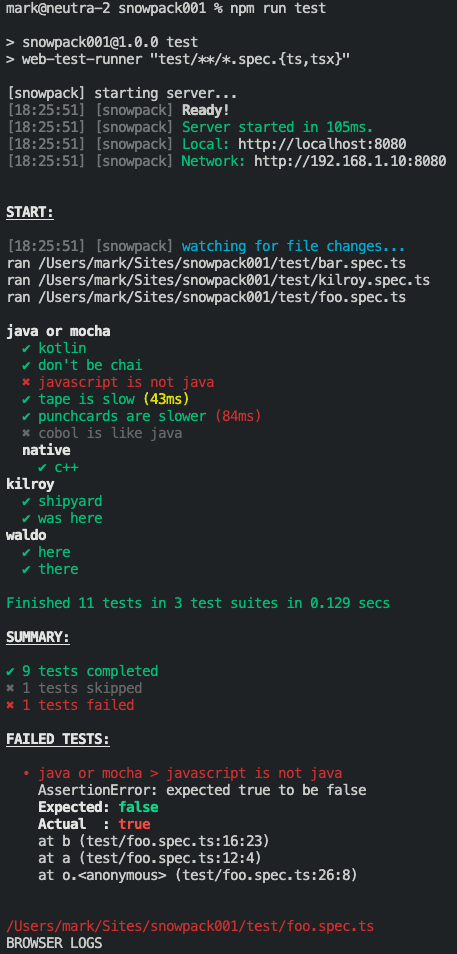

# Goodbye Karma, Welcome Web Test Runner & Snowpack, ...

A while ago I noticed that [toad.js](https://github.com/markandre13/toad.js)' unit tests did not run anymore.

As I like to run the unit tests in a real browser, I had choosen Angular's [Karma](https://karma-runner.github.io/latest/index.html). Setting it up to run Typescript with correct sourcemaps had been quite a challenge in the past and with the new errors, I saw no reason so sink any more time into it, especially
since [ESM](https://developer.mozilla.org/en-US/docs/Web/JavaScript/Reference/Statements/import) there's no need to bundle anymore during development.

After getting [Vite](https://vitejs.dev) and [mocha-vite-puppeteer](https://github.com/larsthorup/mocha-vite-puppeteer) to work, I ran into some issues with esbuild and... wrong line numbers. And I also
wanted something more modular and flexible.

So I took a look at [snowpack](https://www.snowpack.dev) and [web-test-runner](https://modern-web.dev/docs/test-runner/overview/) and found that it provides exactly what I needed: Typescript, Mocha, Chai and a real browser for the DOM.

The only thing missing was a reporter looking like [mocha's spec reporter](https://mochajs.org/#test-duration) or [karma-mocha-reporter](https://www.npmjs.com/package/karma-mocha-reporter).

So here it is: [WTRSpecReporter.js](WTRSpecReporter.js) and that's how it looks:

